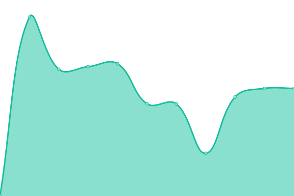
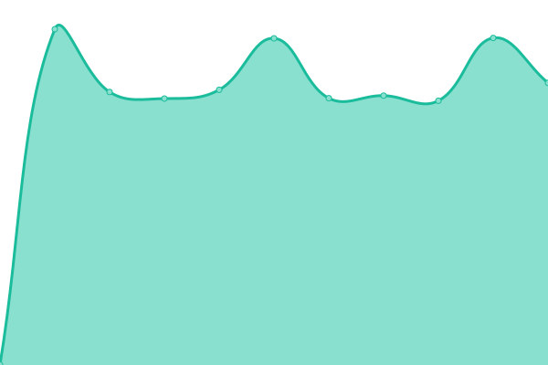

# [📈 Live Status](https://uptime.hblink.it): <!--live status--> **🟩 All systems operational**

This repository contains the open-source uptime monitor and status page for [Roby](https://uptime.hblink.it), powered by [Upptime](https://github.com/upptime/upptime).

With [Upptime](https://upptime.js.org), you can get your own unlimited and free uptime monitor and status page, powered entirely by a GitHub repository. We use [Issues](https://github.com/picchiosat/HBLink-Uptime/issues) as incident reports, [Actions](https://github.com/picchiosat/HBLink-Uptime/actions) as uptime monitors, and [Pages](https://uptime.hblink.it) for the status page.

<!--start: status pages-->
<!-- This summary is generated by Upptime (https://github.com/upptime/upptime) -->
<!-- Do not edit this manually, your changes will be overwritten -->

| URL                                  | Status | History                                                                                         | Response Time                                                                  | Uptime                                                                                                                                                                                                           |
| ------------------------------------ | ------ | ----------------------------------------------------------------------------------------------- | ------------------------------------------------------------------------------ | ---------------------------------------------------------------------------------------------------------------------------------------------------------------------------------------------------------------- |
| [MASTER](http://dashboard.hblink.it) | 🟩 Up  | [master.yml](https://github.com/picchiosat/HBLink-Uptime/commits/master/history/master.yml)     |  1112ms   |      |
| [YSF REF](https://ysf.hblink.it)     | 🟩 Up  | [ysf-ref.yml](https://github.com/picchiosat/HBLink-Uptime/commits/master/history/ysf-ref.yml)   |  2430ms  |    |
| [NXDN REF](https://nxdn.hblink.it)   | 🟩 Up  | [nxdn-ref.yml](https://github.com/picchiosat/HBLink-Uptime/commits/master/history/nxdn-ref.yml) |  1706ms |  |
| [P25 REF](https://p25.hblink.it)     | 🟩 Up  | [p25-ref.yml](https://github.com/picchiosat/HBLink-Uptime/commits/master/history/p25-ref.yml)   |  1981ms  |    |
| [M17 REF](https://m17ita.hblink.it)  | 🟩 Up  | [m17-ref.yml](https://github.com/picchiosat/HBLink-Uptime/commits/master/history/m17-ref.yml)   |  791ms   |    |
| [XLX965](https://xlx965.hblink.it)   | 🟩 Up  | [xlx-965.yml](https://github.com/picchiosat/HBLink-Uptime/commits/master/history/xlx-965.yml)   |  914ms   |    |
| [APRS](https://aprs.hblink.it)       | 🟩 Up  | [aprs.yml](https://github.com/picchiosat/HBLink-Uptime/commits/master/history/aprs.yml)         |  800ms      |          |

<!--end: status pages-->

[**Visit our status website →**](https://uptime.hblink.it)

## 📄 License

- Code: [MIT](./LICENSE) © [Roby](https://uptime.hblink.it)
- Data in the `./history` directory: [Open Database License](https://opendatacommons.org/licenses/odbl/1-0/)
