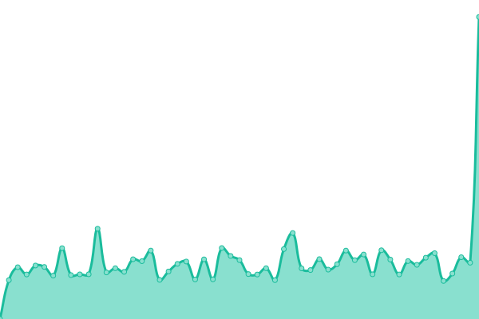

# [📈 Live Status](https://uptime.hblink.it): <!--live status--> **🟧 Partial outage**

This repository contains the open-source uptime monitor and status page for [Roby](https://uptime.hblink.it), powered by [Upptime](https://github.com/upptime/upptime).

With [Upptime](https://upptime.js.org), you can get your own unlimited and free uptime monitor and status page, powered entirely by a GitHub repository. We use [Issues](https://github.com/picchiosat/HBLink-Uptime/issues) as incident reports, [Actions](https://github.com/picchiosat/HBLink-Uptime/actions) as uptime monitors, and [Pages](https://uptime.hblink.it) for the status page.

<!--start: status pages-->
<!-- This summary is generated by Upptime (https://github.com/upptime/upptime) -->
<!-- Do not edit this manually, your changes will be overwritten -->
<!-- prettier-ignore -->
| URL | Status | History | Response Time | Uptime |
| --- | ------ | ------- | ------------- | ------ |
|  [National MP Node](http://dashboard.hblink.it) | 🟥 Down | [national-mp-node.yml](https://github.com/picchiosat/HBLink-Uptime/commits/HEAD/history/national-mp-node.yml) | 

 1039ms
     
 | 

<a href="https://uptime.hblink.it/history/national-mp-node">99.97%</a>
    

|  [YSF REF](https://ysf.freedmr.it) | 🟥 Down | [ysf-ref.yml](https://github.com/picchiosat/HBLink-Uptime/commits/HEAD/history/ysf-ref.yml) | 

 1001ms
     
 | 

<a href="https://uptime.hblink.it/history/ysf-ref">92.78%</a>
    

|  [NXDN REF](https://nxdn.hblink.it) | 🟥 Down | [nxdn-ref.yml](https://github.com/picchiosat/HBLink-Uptime/commits/HEAD/history/nxdn-ref.yml) | 

 1898ms
     
 | 

<a href="https://uptime.hblink.it/history/nxdn-ref">99.98%</a>
    

|  [P25 REF](https://p25.hblink.it) | 🟥 Down | [p25-ref.yml](https://github.com/picchiosat/HBLink-Uptime/commits/HEAD/history/p25-ref.yml) | 

 1737ms
     
 | 

<a href="https://uptime.hblink.it/history/p25-ref">99.98%</a>
    

|  [M17 REF](https://m17ita.hblink.it) | 🟥 Down | [m17-ref.yml](https://github.com/picchiosat/HBLink-Uptime/commits/HEAD/history/m17-ref.yml) | 

 618ms
     
 | 

<a href="https://uptime.hblink.it/history/m17-ref">99.99%</a>
    

|  [XLX965](https://xlx965.hblink.it) | 🟥 Down | [xlx-965.yml](https://github.com/picchiosat/HBLink-Uptime/commits/HEAD/history/xlx-965.yml) | 

 778ms
     
 | 

<a href="https://uptime.hblink.it/history/xlx-965">99.99%</a>
    

|  [FreeDMR IT Bridge](https://dashboard.freedmr.it) | 🟩 Up | [free-dmr-it-bridge.yml](https://github.com/picchiosat/HBLink-Uptime/commits/HEAD/history/free-dmr-it-bridge.yml) | 

 767ms
     
 | 

<a href="https://uptime.hblink.it/history/free-dmr-it-bridge">92.96%</a>
    

|  [FreeDMR IT Hotspots](https://hotspot.freedmr.it) | 🟩 Up | [free-dmr-it-hotspots.yml](https://github.com/picchiosat/HBLink-Uptime/commits/HEAD/history/free-dmr-it-hotspots.yml) | 

 743ms
     
 | 

<a href="https://uptime.hblink.it/history/free-dmr-it-hotspots">92.96%</a>
    

<!--end: status pages-->

[**Visit our status website →**](https://uptime.hblink.it)

## 📄 License

- Code: [MIT](./LICENSE) © [Roby](https://uptime.hblink.it)
- Data in the `./history` directory: [Open Database License](https://opendatacommons.org/licenses/odbl/1-0/)
